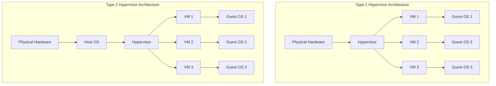
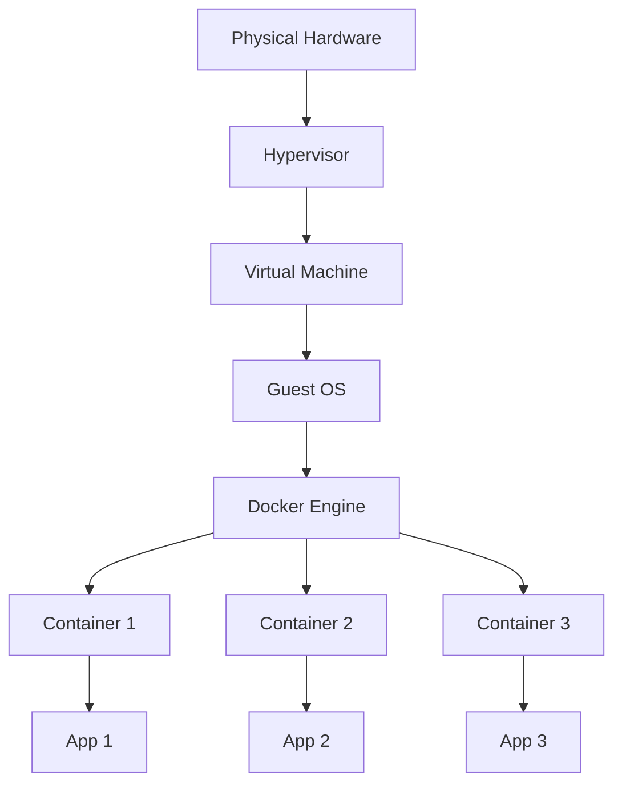
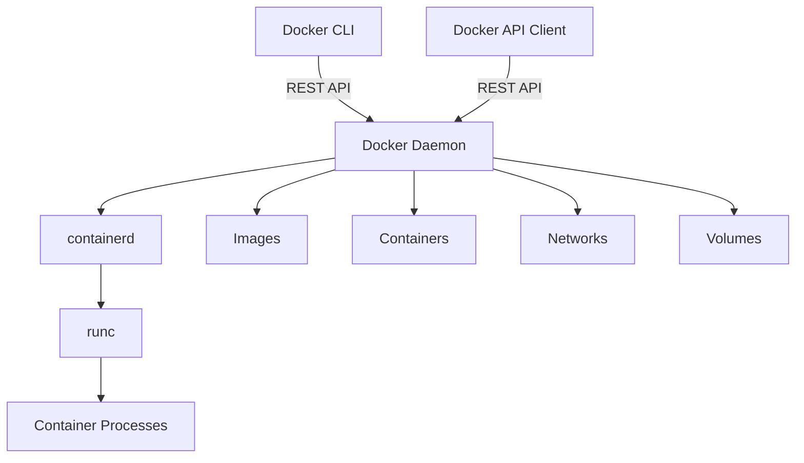
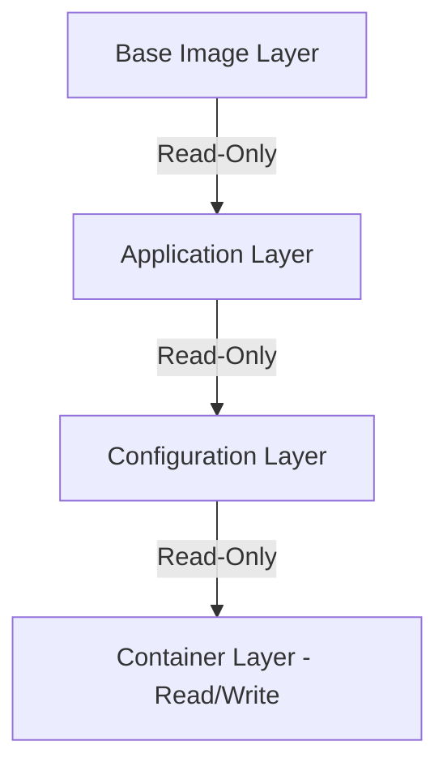
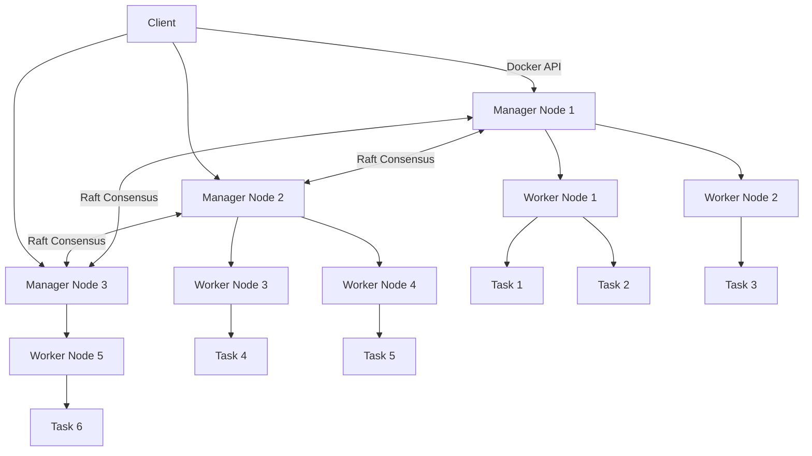

# Docker Basics

## Table of Contents


- [Virtual Machines](#virtual-machines)
    - [What are Virtual Machines?](#what-are-virtual-machines)
    - [Architecture of Virtual Machines](#architecture-of-virtual-machines)
- [Docker](#docker)
    - [What is Docker?](#what-is-docker)
    - [Why Use Docker?](#why-use-docker)
    - [Architecture of Docker on a Virtual Machine](#architecture-of-docker-on-a-virtual-machine)
    - [What are Docker Images and Docker Containers?](#what-are-docker-images-and-docker-containers)
- [Basic Docker Commands](#basic-docker-commands)
    - [Image Management](#image-management)
    - [Container Management](#container-management)
    - [Docker System](#docker-system)
    - [Network Management](#network-management)
    - [Volume Management](#volume-management)
    - [Common Options for `docker run` Command](#common-options-for-docker-run-command)
- [Creating a Docker Image](#creating-a-docker-image)
    - [Dockerfile](#dockerfile)
    - [Basic Dockerfile Keywords](#basic-dockerfile-keywords)
    - [Environment Variables](#environment-variables)
    - [Commands vs. Entrypoint](#commands-vs-entrypoint)
- [Docker Compose](#docker-compose)
    - [Why Docker Compose?](#why-docker-compose)
    - [Versions of Docker Compose Files](#versions-of-docker-compose-files)
    - [Service Linking in Different Versions](#service-linking-in-different-versions)
    - [Docker Compose Example for FastAPI with PostgreSQL](#docker-compose-example-for-fastapi-with-postgresql)
- [Docker Engine and Storage](#docker-engine-and-storage)
    - [Docker Engine](#docker-engine)
    - [Key Components of Docker Engine](#key-components-of-docker-engine)
    - [Docker Engine Configuration](#docker-engine-configuration)
    - [Docker Storage](#docker-storage)
    - [Storage Drivers](#storage-drivers)
    - [Image Layering](#image-layering)
    - [Container Writability](#container-writability)
    - [Docker Volumes](#docker-volumes)
    - [Volume Drivers](#volume-drivers)
- [Docker Networking](#docker-networking)
    - [Network Types](#network-types)
    - [Bridge Network](#bridge-network)
    - [Host Network](#host-network)
    - [None Network](#none-network)
    - [Overlay Network](#overlay-network)
    - [Macvlan Network](#macvlan-network)
    - [Managing Docker Networks](#managing-docker-networks)
    - [Network Configuration in Docker Compose](#network-configuration-in-docker-compose)
- [Docker Registry](#docker-registry)
    - [Docker Hub](#docker-hub)
    - [Private Registries](#private-registries)
    - [Working with Registries](#working-with-registries)
    - [Registry Security](#registry-security)
- [Docker Swarm](#docker-swarm)
    - [Why Docker Swarm?](#why-docker-swarm)
    - [Docker Swarm Architecture](#docker-swarm-architecture)
    - [Setting Up a Docker Swarm](#setting-up-a-docker-swarm)
    - [Managing Swarm Nodes](#managing-swarm-nodes)
    - [Deploying Services to Swarm](#deploying-services-to-swarm)
    - [Service Placement and Constraints](#service-placement-and-constraints)
    - [Stack Deployment with Docker Compose](#stack-deployment-with-docker-compose)
    - [Docker Swarm Networking](#docker-swarm-networking)
    - [Swarm Secrets Management](#swarm-secrets-management)
    - [Service Updates and Rollbacks](#service-updates-and-rollbacks)
    - [Monitoring and Troubleshooting](#monitoring-and-troubleshooting)
    - [Comparison: Docker Swarm vs Kubernetes](#comparison-docker-swarm-vs-kubernetes)

---

## Virtual Machines

### What are Virtual Machines?

Virtual machines (VMs) are software emulations of physical computers that run on a host machine. They create isolated environments where you can run different operating systems and applications independently from the host system. Each virtual machine includes a complete implementation of a computer system, including:

- Virtual hardware (CPU, memory, storage, network interfaces)
- A guest operating system
- Application software

This technology allows you to run multiple operating systems simultaneously on a single physical machine, making efficient use of hardware resources while maintaining isolation between workloads.

### Architecture of Virtual Machines

Virtual machines operate through a layer of software called a hypervisor (or Virtual Machine Monitor), which manages the virtualization process. There are two main types of hypervisor architectures:

**Type 1 (Bare-metal) Hypervisor:**
- Runs directly on the host's hardware
- Controls hardware resources and manages guest operating systems
- Examples: VMware ESXi, Microsoft Hyper-V, Xen

**Type 2 (Hosted) Hypervisor:**
- Runs on a conventional operating system
- Guest VMs run as processes on the host OS
- Examples: VMware Workstation, Oracle VirtualBox, QEMU



Each virtual machine includes:
- **Virtual CPU**: Emulates the behavior of a physical processor
- **Virtual Memory**: Dedicated portion of RAM allocated to the VM
- **Virtual Storage**: Virtual hard disks (VHD files)
- **Virtual Network Interfaces**: Allow VMs to communicate with each other and external networks

While virtual machines provide excellent isolation and compatibility, they consume significant resources because each VM requires its own operating system and virtualized hardware. This overhead led to the development of container technologies like Docker.

## Docker

### What is Docker?

Docker is a platform for developing, shipping, and running applications in isolated environments called containers. Unlike virtual machines, Docker containers share the host operating system's kernel, making them more lightweight and efficient. Docker provides a way to package applications with all their dependencies and configurations, ensuring consistent behavior across different environments.

The key components of Docker include:
- **Docker Engine**: The runtime that enables creating and running containers
- **Docker Images**: Read-only templates containing application code, runtime, libraries, and dependencies
- **Docker Containers**: Running instances of Docker images
- **Docker Registry**: Storage for Docker images (like Docker Hub)

### Why Use Docker?

Docker offers numerous advantages that have made it the standard for containerization:

1. **Consistency**: "It works on my machine" is no longer an issue since Docker ensures the same environment in development, testing, and production.

2. **Isolation**: Applications run in isolated containers, preventing conflicts between applications and dependencies.

3. **Portability**: Docker containers can run on any platform that supports Docker, making applications easily portable.

4. **Efficiency**: Containers share the host OS kernel and use fewer resources than VMs, allowing for higher density deployment.

5. **Rapid Deployment**: Docker containers start almost instantly compared to VMs that need to boot an entire OS.

6. **Version Control**: Docker images can be versioned, allowing you to track changes and roll back if needed.

7. **Microservices Support**: Docker's lightweight nature makes it ideal for microservices architecture.

8. **DevOps Integration**: Docker streamlines CI/CD pipelines by providing consistent environments throughout the process.

### Architecture of Docker on a Virtual Machine

When Docker runs on a virtual machine, it creates a layered architecture:



In this architecture:
- The physical server hosts a hypervisor
- The hypervisor runs one or more virtual machines
- Each VM has its guest operating system
- Docker Engine runs on the guest OS
- Docker containers run as isolated processes sharing the guest OS kernel

This approach combines the benefits of VMs (strong isolation from the host) with the efficiency of containers (resource sharing within the VM).

### What are Docker Images and Docker Containers?

**Docker Images:**
Docker images are read-only templates that contain everything needed to run an application: code, runtime, libraries, environment variables, and configuration files. They are built from a set of instructions in a Dockerfile.

Key characteristics of Docker images:
- Immutable: Once created, images don't change
- Layered: Images are built in layers, with each layer representing a set of filesystem changes
- Shareable: Images can be stored in registries and shared between teams
- Versioned: Images use tags to identify different versions
- Hierarchical: Images can be built on top of other images (base images)

**Docker Containers:**
Containers are runnable instances of Docker images. When you launch a container, Docker creates a writable layer on top of the immutable image layers where the application can run.

Key characteristics of Docker containers:
- Isolated: Containers run in isolation from each other and the host system
- Ephemeral: Containers are designed to be temporary and disposable
- Stateless by default: Data in containers is lost when the container is removed (unless volumes are used)
- Lightweight: Multiple containers share the OS kernel
- Portable: Containers can run anywhere Docker is installed

The relationship between images and containers is similar to classes and objects in programming:
- The image is the blueprint (class)
- The container is the running instance (object)

## Basic Docker Commands

Docker commands follow a general structure of `docker [command-type] [options] [command-objects]`. Here are the most important Docker commands organized by functionality:

### Image Management

| Command | Description | Example |
|---------|-------------|---------|
| `docker pull` | Download an image from a registry | `docker pull ubuntu:22.04` |
| `docker push` | Upload an image to a registry | `docker push myuser/myapp:1.0` |
| `docker build` | Build an image from a Dockerfile | `docker build -t myapp:1.0 .` |
| `docker images` | List all local images | `docker images` |
| `docker rmi` | Remove one or more images | `docker rmi nginx:latest` |
| `docker tag` | Create a tag for an image | `docker tag myapp:latest myapp:1.0` |
| `docker history` | Show history of an image | `docker history ubuntu:22.04` |
| `docker save` | Save image to a tar archive | `docker save -o ubuntu.tar ubuntu:22.04` |
| `docker load` | Load image from a tar archive | `docker load -i ubuntu.tar` |

### Container Management

| Command | Description | Example |
|---------|-------------|---------|
| `docker run` | Create and start a container | `docker run -d --name web nginx` |
| `docker start` | Start one or more stopped containers | `docker start web` |
| `docker stop` | Stop one or more running containers | `docker stop web` |
| `docker restart` | Restart one or more containers | `docker restart web` |
| `docker pause` | Pause processes in a container | `docker pause web` |
| `docker unpause` | Unpause processes in a container | `docker unpause web` |
| `docker kill` | Kill one or more running containers | `docker kill web` |
| `docker rm` | Remove one or more containers | `docker rm web` |
| `docker ps` | List running containers | `docker ps` |
| `docker ps -a` | List all containers (running and stopped) | `docker ps -a` |
| `docker exec` | Run a command in a running container | `docker exec -it web bash` |
| `docker logs` | Fetch the logs of a container | `docker logs web` |
| `docker inspect` | Return detailed information on a container | `docker inspect web` |
| `docker stats` | Display live stream of container resource usage | `docker stats` |
| `docker top` | Display the running processes of a container | `docker top web` |
| `docker diff` | Inspect changes to files in a container | `docker diff web` |
| `docker cp` | Copy files between container and host | `docker cp web:/app/log.txt ./log.txt` |

### Docker System

| Command | Description | Example |
|---------|-------------|---------|
| `docker info` | Display system-wide information | `docker info` |
| `docker version` | Show Docker version information | `docker version` |
| `docker system df` | Show Docker disk usage | `docker system df` |
| `docker system prune` | Remove unused data | `docker system prune -a` |
| `docker events` | Get real-time events from Docker | `docker events` |

### Network Management

| Command | Description | Example |
|---------|-------------|---------|
| `docker network create` | Create a network | `docker network create mynetwork` |
| `docker network ls` | List networks | `docker network ls` |
| `docker network inspect` | Display detailed network information | `docker network inspect bridge` |
| `docker network connect` | Connect a container to a network | `docker network connect mynetwork web` |
| `docker network disconnect` | Disconnect a container from a network | `docker network disconnect mynetwork web` |
| `docker network rm` | Remove one or more networks | `docker network rm mynetwork` |
| `docker network prune` | Remove all unused networks | `docker network prune` |

### Volume Management

| Command | Description | Example |
|---------|-------------|---------|
| `docker volume create` | Create a volume | `docker volume create mydata` |
| `docker volume ls` | List volumes | `docker volume ls` |
| `docker volume inspect` | Display detailed volume information | `docker volume inspect mydata` |
| `docker volume rm` | Remove one or more volumes | `docker volume rm mydata` |
| `docker volume prune` | Remove all unused volumes | `docker volume prune` |

### Common Options for `docker run` Command

The `docker run` command has many options that control how containers are created and run:

- `-d, --detach`: Run container in background
- `-e, --env`: Set environment variables
- `-p, --publish`: Publish container's port to the host
- `-v, --volume`: Bind mount a volume
- `--name`: Assign a name to the container
- `--network`: Connect to a network
- `--restart`: Restart policy
- `-it`: Interactive mode with pseudo-TTY
- `--rm`: Automatically remove the container when it exits
- `--memory`: Memory limit
- `--cpus`: CPU limit

Example of a complex `docker run` command:
```bash
docker run -d --name webapp \
  -p 8080:80 \
  -v app-data:/var/www/html \
  -e DB_HOST=mysql \
  --network app-network \
  --restart unless-stopped \
  --memory 512m \
  --cpus 0.5 \
  myapp:1.0
```

This command creates a detached container named "webapp" that:
- Maps port 8080 on the host to port 80 in the container
- Mounts the "app-data" volume to /var/www/html
- Sets the DB_HOST environment variable to "mysql"
- Connects to the "app-network" network
- Automatically restarts unless explicitly stopped
- Limits memory to 512MB and CPU usage to 50% of one core

## Creating a Docker Image

### Dockerfile

A Dockerfile is a text file containing instructions for building a Docker image. Each instruction creates a layer in the image, making the build process efficient and allowing layers to be cached when rebuilding similar images.

#### Basic Dockerfile Keywords

| Instruction | Description |
|-------------|-------------|
| `FROM` | Sets the base image for subsequent instructions |
| `LABEL` | Adds metadata to an image |
| `RUN` | Executes commands in a new layer and creates a new image |
| `COPY` | Copies files from the host to the container filesystem |
| `ADD` | Similar to COPY but also can handle URLs and automatically extract tar archives |
| `WORKDIR` | Sets the working directory for subsequent instructions |
| `ENV` | Sets environment variables |
| `EXPOSE` | Informs Docker that the container listens on specified network ports |
| `USER` | Sets the user name or UID to use when running the image |
| `VOLUME` | Creates a mount point for persistent data |
| `CMD` | Provides default command for executing the container |
| `ENTRYPOINT` | Configures the container to run as an executable |
| `ARG` | Defines build-time variables |
| `HEALTHCHECK` | Tells Docker how to test a container to check it's still working |
| `SHELL` | Overrides the default shell used for commands |
| `STOPSIGNAL` | Sets the system call signal to send to the container to exit |
| `ONBUILD` | Adds a trigger instruction executed when the image is used as the base for another build |

#### Sample Dockerfile for a FastAPI Application with PostgreSQL

Here's a comprehensive Dockerfile for a FastAPI application that connects to a PostgreSQL database:

```dockerfile
# Use official Python runtime as a base image
FROM python:3.11-slim

# Set the working directory in the container
WORKDIR /app

# Add metadata to the image
LABEL maintainer="developer@example.com"
LABEL version="1.0"
LABEL description="FastAPI application with PostgreSQL database"

# Set environment variables
# Using ENV for environment variables that should be available at runtime
ENV PYTHONDONTWRITEBYTECODE=1 \
    PYTHONUNBUFFERED=1 \
    POETRY_VERSION=1.4.2 \
    POETRY_HOME="/opt/poetry" \
    POETRY_VIRTUALENVS_IN_PROJECT=false \
    POETRY_NO_INTERACTION=1

# Install system dependencies
RUN apt-get update \
    && apt-get install -y --no-install-recommends \
        postgresql-client \
        curl \
        build-essential \
    && apt-get clean \
    && rm -rf /var/lib/apt/lists/*

# Install Poetry
RUN curl -sSL https://install.python-poetry.org | python3 -
ENV PATH="$POETRY_HOME/bin:$PATH"

# Copy poetry configuration files
COPY pyproject.toml poetry.lock* ./

# Install dependencies
RUN poetry config virtualenvs.create false \
    && poetry install --no-interaction --no-ansi --no-dev

# Copy the application code
COPY ./app ./app

# Create a non-root user and switch to it
RUN adduser --disabled-password --gecos "" appuser
USER appuser

# Make port 8000 available to the world outside this container
EXPOSE 8000

# Create a health check
HEALTHCHECK --interval=30s --timeout=5s --start-period=5s --retries=3 \
    CMD curl -f http://localhost:8000/health || exit 1

# Use ENTRYPOINT for the application that should always run
ENTRYPOINT ["uvicorn"]

# Use CMD for arguments that can be overridden
CMD ["app.main:app", "--host", "0.0.0.0", "--port", "8000"]

```

This Dockerfile:
1. Uses Python 3.11 as the base image
2. Sets up a working directory
3. Adds metadata using LABEL instructions
4. Configures environment variables
5. Installs system dependencies including PostgreSQL client
6. Installs Poetry for Python dependency management
7. Copies and installs application dependencies
8. Copies the application code
9. Creates a non-root user for security
10. Exposes port 8000
11. Defines a health check
12. Uses ENTRYPOINT and CMD to start the FastAPI application

### Environment Variables

Environment variables in Docker allow you to pass configuration information to containers. They can be set in several ways:

1. **In the Dockerfile using `ENV`**:
   ```dockerfile
   ENV APP_PORT=8000
   ENV DB_HOST=postgres
   ```

2. **At container runtime using the `-e` or `--env` flag**:
   ```bash
   docker run -e DB_HOST=postgres -e DB_PASSWORD=secret myapp
   ```

3. **Using an environment file with `--env-file`**:
   ```bash
   docker run --env-file ./config.env myapp
   ```

4. **In Docker Compose using the `environment` or `env_file` options**:
   ```yaml
   services:
     app:
       image: myapp
       environment:
         - DB_HOST=postgres
         - DB_PASSWORD=secret
   ```

Environment variables are used for:
- Configuration without rebuilding the image
- Secrets management (although secrets are better handled via Docker Secrets)
- Runtime parameters
- Service discovery in container orchestration

Best practices for environment variables:
- Never hardcode sensitive values in the Dockerfile
- Use default values that can be overridden at runtime
- Validate environment variables in your application
- Document required environment variables

### Commands vs. Entrypoint

Docker uses two instructions for defining the command that runs when a container starts: `CMD` and `ENTRYPOINT`. Understanding the difference between them is crucial:

**CMD**:
- Defines default commands and/or parameters
- Can be easily overridden by parameters passed to `docker run`
- Three forms:
  - `CMD ["executable", "param1", "param2"]` (exec form, preferred)
  - `CMD command param1 param2` (shell form)
  - `CMD ["param1", "param2"]` (parameters for ENTRYPOINT)

**ENTRYPOINT**:
- Configures a container to run as an executable
- Not easily overridden (you must use `--entrypoint` flag)
- Two forms:
  - `ENTRYPOINT ["executable", "param1", "param2"]` (exec form, preferred)
  - `ENTRYPOINT command param1 param2` (shell form)

**How they work together**:

When both `ENTRYPOINT` and `CMD` are specified:
- `ENTRYPOINT` defines the executable that will run
- `CMD` provides default arguments to that executable
- Arguments to `docker run` will override the `CMD` arguments but not the `ENTRYPOINT` executable

Example:
```dockerfile
ENTRYPOINT ["python", "app.py"]
CMD ["--port", "8000"]
```

Running `docker run myimage` will execute `python app.py --port 8000`.
Running `docker run myimage --port 5000` will execute `python app.py --port 5000`.

Common use cases:
- Use `ENTRYPOINT` for the primary executable that should always run
- Use `CMD` for default arguments that might need to be overridden
- Use `ENTRYPOINT` for creating "executable" images that act like binaries

## Docker Compose

### Why Docker Compose?

Docker Compose is a tool for defining and running multi-container Docker applications. It addresses several challenges in container management:

1. **Simplifying Multi-Container Setup**: Define an entire application stack in a single YAML file instead of managing individual containers with complex `docker run` commands.

2. **Declarative Configuration**: Express the desired state of your application infrastructure as code.

3. **Environment Consistency**: Ensure all team members run the same container configuration.

4. **Service Orchestration**: Define dependencies between services, ensuring they start in the correct order.

5. **Development Workflow**: Streamline the development process with commands like `docker-compose up` and `docker-compose down`.

6. **Resource Grouping**: Group all containers and other resources (networks, volumes) under a single project.

7. **Local Environment Parity**: Create development environments that closely mirror production.

### Versions of Docker Compose Files

Docker Compose file versions have evolved over time, adding new features and functionality:

#### Version 1 (Legacy)
- Basic service definitions
- No named volumes or networks
- No health checks
- No deploy options
- Less structure in the YAML file

Example:
```yaml
web:
  image: nginx
  ports:
    - "80:80"
  links:
    - db
db:
  image: postgres
```

#### Version 2
- Introduced in Docker Compose 1.6.0
- Added named volumes and networks
- Services organized under a "services" key
- Added dependencies with `depends_on`
- Added network configuration
- Introduced version at the top of the file

Example:
```yaml
version: '2'
services:
  web:
    image: nginx
    ports:
      - "80:80"
    depends_on:
      - db
  db:
    image: postgres
volumes:
  db-data:
networks:
  frontend:
  backend:
```

#### Version 3
- Introduced in Docker Compose 1.10.0
- Designed for Docker Swarm compatibility
- Added deploy configuration for orchestration
- Introduced secrets and configs
- Removed links in favor of networks
- Added healthcheck definition

Example:
```yaml
version: '3'
services:
  web:
    image: nginx
    ports:
      - "80:80"
    depends_on:
      - db
    deploy:
      replicas: 2
  db:
    image: postgres
    volumes:
      - db-data:/var/lib/postgresql/data
    healthcheck:
      test: ["CMD", "pg_isready", "-U", "postgres"]
volumes:
  db-data:
```

#### Version 3.x Subversions
Each subversion of Compose version 3 added new features:
- 3.1: Added secrets
- 3.2: Added long syntax for ports, volumes
- 3.3: Added build context, credential_spec
- 3.4: Added target for multi-stage builds, rollback_config
- 3.5: Added isolation, named volumes for build context
- 3.6: Added tmpfs size
- 3.7: Added init, order of start/stop
- 3.8: Added configs expansion, attachable networks
- 3.9: Added the capability to include environment variables from another file

#### Key Differences Between Versions

| Feature | Version 1 | Version 2 | Version 3 |
|---------|-----------|-----------|-----------|
| Structure | Flat | Services, networks, volumes | Services, networks, volumes, secrets, configs |
| Service dependencies | links | depends_on | depends_on |
| Named volumes | No | Yes | Yes |
| Networks | No | Yes | Yes |
| Deploy options | No | No | Yes |
| Health checks | No | No | Yes |
| Secrets | No | No | Yes (3.1+) |
| Configs | No | No | Yes (3.3+) |
| Swarm compatibility | No | Limited | Full |

### Service Linking in Different Versions

The way services connect and communicate with each other has evolved across Docker Compose versions:

#### Version 1: Links
In version 1, `links` were used to enable discovery between containers:
```yaml
web:
  image: nginx
  links:
    - db:database
db:
  image: postgres
```
This would:
- Create a network connection between the web and db containers
- Create /etc/hosts entries in the web container
- Set environment variables in the web container (DB_PORT, DB_NAME, etc.)
- Create a dependency ordering

#### Version 2: Networks and depends_on
Version 2 introduced automatic DNS resolution and dedicated networks:
```yaml
version: '2'
services:
  web:
    image: nginx
    depends_on:
      - db
  db:
    image: postgres
networks:
  default:
    driver: bridge
```
This approach:
- Creates a default network for all services
- Allows service discovery by container name
- Uses `depends_on` for startup order (not for waiting until services are ready)

#### Version 3: Swarm-Compatible Networking
Version 3 maintained the networking from version 2 but added swarm-mode compatibility:
```yaml
version: '3'
services:
  web:
    image: nginx
    networks:
      - frontend
      - backend
  db:
    image: postgres
    networks:
      - backend
networks:
  frontend:
  backend:
```
Key features:
- Service discovery works across swarm nodes
- Services can connect to multiple networks
- Networks can be configured with overlay drivers for multi-host communication

#### Health-Based Dependencies (Version 2.1+ and 3.x)
From version 2.1, you can use health checks with `depends_on`:
```yaml
version: '2.1'
services:
  web:
    image: nginx
    depends_on:
      db:
        condition: service_healthy
  db:
    image: postgres
    healthcheck:
      test: ["CMD", "pg_isready", "-U", "postgres"]
      interval: 5s
      timeout: 5s
      retries: 5
```
This ensures that the web service only starts after the db service is healthy, not just started.

## Docker Compose Example for FastAPI with PostgreSQL

Here's a comprehensive Docker Compose file for a FastAPI application with PostgreSQL:

```yaml
version: '3.8'

services:
  # API service
  api:
    build:
      context: .
      dockerfile: Dockerfile
    image: fastapi-app:latest
    container_name: fastapi-app
    restart: unless-stopped
    ports:
      - "8000:8000"
    environment:
      - DATABASE_URL=postgresql://postgres:postgres@db:5432/app_db
      - DEBUG=false
      - SECRET_KEY=${SECRET_KEY:-default_dev_key}
      - ALLOWED_HOSTS=localhost,127.0.0.1
    depends_on:
      db:
        condition: service_healthy
    networks:
      - app-network
    volumes:
      - ./app:/app/app
    healthcheck:
      test: ["CMD", "curl", "-f", "http://localhost:8000/health"]
      interval: 30s
      timeout: 10s
      retries: 3
      start_period: 10s
    deploy:
      resources:
        limits:
          cpus: '0.5'
          memory: 512M

  # Database service
  db:
    image: postgres:14-alpine
    container_name: postgres-db
    restart: unless-stopped
    environment:
      - POSTGRES_USER=postgres
      - POSTGRES_PASSWORD=postgres
      - POSTGRES_DB=app_db
    ports:
      - "5432:5432"
    networks:
      - app-network
    volumes:
      - postgres-data:/var/lib/postgresql/data
      - ./init-scripts:/docker-entrypoint-initdb.d
    healthcheck:
      test: ["CMD-SHELL", "pg_isready -U postgres"]
      interval: 5s
      timeout: 5s
      retries: 5
    deploy:
      resources:
        limits:
          cpus: '0.5'
          memory: 512M

  # pgAdmin for database management (development only)
  pgadmin:
    image: dpage/pgadmin4
    container_name: pgadmin
    restart: unless-stopped
    environment:
      - PGADMIN_DEFAULT_EMAIL=admin@example.com
      - PGADMIN_DEFAULT_PASSWORD=admin
    ports:
      - "5050:80"
    networks:
      - app-network
    volumes:
      - pgadmin-data:/var/lib/pgadmin
    depends_on:
      - db
    profiles:
      - dev

volumes:
  postgres-data:
    name: postgres-data
  pgadmin-data:
    name: pgadmin-data

networks:
  app-network:
    driver: bridge
    name: app-network

```

This Docker Compose file:
1. Defines three services: the FastAPI application, PostgreSQL database, and pgAdmin (for development)
2. Uses environment variables for configuration
3. Sets up health checks for both the API and database
4. Defines named volumes for data persistence
5. Creates a dedicated network for service communication
6. Uses resource limits to prevent container resource starvation
7. Uses restart policies for reliability
8. Uses profiles to make pgAdmin optional (only started with `docker-compose --profile dev up`)

## Docker Engine and Storage

### Docker Engine

Docker Engine is the core component that enables Docker functionality. It's a client-server application consisting of:

1. **Docker Daemon (dockerd)**: The persistent background process that manages Docker objects (images, containers, networks, volumes).

2. **REST API**: Provides interfaces that programs can use to communicate with the daemon.

3. **Docker CLI (docker)**: A command-line interface for interacting with Docker through the REST API.



#### Key Components of Docker Engine

**containerd**: A daemon responsible for container lifecycle operations:
- Container execution and supervision
- Image distribution
- Network attachment
- Management of storage

**runc**: A lightweight, portable container runtime that implements the OCI (Open Container Initiative) specification:
- Creates containers
- Manages container processes
- Handles containerization primitives

#### Docker Engine Configuration

Docker Engine can be configured through a configuration file, typically located at `/etc/docker/daemon.json`. Some important configuration options include:

```json
{
  "data-root": "/var/lib/docker",
  "default-runtime": "runc",
  "log-driver": "json-file",
  "log-opts": {
    "max-size": "10m",
    "max-file": "3"
  },
  "storage-driver": "overlay2",
  "registry-mirrors": ["https://mirror.example.com"],
  "insecure-registries": ["192.168.1.100:5000"],
  "debug": false,
  "experimental": false
}
```

To apply configuration changes, restart the Docker daemon:
```bash
sudo systemctl restart docker
```

Commands for managing Docker Engine:
```bash
# Check Docker daemon status
sudo systemctl status docker

# Restart Docker daemon
sudo systemctl restart docker

# View Docker daemon logs
sudo journalctl -u docker.service

# Show Docker engine information
docker info

# Display Docker engine version
docker version
```

### Docker Storage

Docker provides several storage options for both images and containers:

#### Storage Drivers

Storage drivers manage how images and container layers are stored and accessed on the host. Docker supports several storage drivers, each with different characteristics:

1. **overlay2**: The recommended storage driver for most Linux distributions
   - Uses overlay filesystem
   - Efficient use of memory
   - Fast container startup

2. **aufs**: One of the oldest drivers
   - Good stability but less performant
   - Not in the mainline Linux kernel

3. **devicemapper**: Uses thin provisioning and snapshotting
   - Good isolation
   - Can be configured for direct-lvm for production

4. **btrfs** and **zfs**: File systems with built-in snapshotting capabilities
   - Good performance and advanced features
   - Require specific filesystem support in the host

5. **vfs**: Simple driver that copies files (no CoW or snapshots)
   - Very slow but works everywhere
   - Used mostly for testing or when no copy-on-write support exists

To check which storage driver is in use:
```bash
docker info | grep "Storage Driver"
```

To change the storage driver, edit the daemon.json file:
```json
{
  "storage-driver": "overlay2"
}
```

#### Image Layering

Docker images are built as a series of layers, each representing a change to the filesystem. This approach provides several benefits:

1. **Space Efficiency**: Layers are shared between images, saving disk space.
2. **Build Efficiency**: Only changed layers need to be rebuilt, making builds faster.
3. **Distribution Efficiency**: Only layers that don't exist on the target host need to be downloaded.



To inspect the layers of an image:
```bash
docker history nginx:latest
```

#### Container Writability

When a container runs, Docker adds a writable layer on top of the immutable image layers. This is called the "container layer" and it's where all changes to the running container are stored. When a container is deleted, all data in this layer is lost unless it has been saved in a persistent storage volume.

#### Docker Volumes

Volumes are the preferred mechanism for persisting data generated by and used by Docker containers. They are completely managed by Docker and have several advantages:

1. **Persistence**: Data survives container removal
2. **Sharing**: Volumes can be shared between containers
3. **Performance**: For many use cases, volumes offer better performance than bind mounts
4. **Host-independence**: Volumes work on both Linux and Windows containers
5. **Backup capability**: Volumes can be backed up or restored more easily

Types of Docker volumes:

1. **Named Volumes**: Created and managed by Docker
   ```bash
   # Create a named volume
   docker volume create my-data
   
   # Run a container with a named volume
   docker run -v my-data:/app/data nginx
   ```

2. **Host Bind Mounts**: Directory or file from the host mounted into a container
   ```bash
   # Mount a host directory to a container
   docker run -v /host/path:/container/path nginx
   ```

3. **Tmpfs Mounts**: Stored in the host system's memory only
   ```bash
   # Create a temporary in-memory mount
   docker run --tmpfs /app/temp nginx
   ```

Commands for managing volumes:
```bash
# List all volumes
docker volume ls

# Inspect a volume
docker volume inspect my-data

# Remove a volume
docker volume rm my-data

# Remove all unused volumes
docker volume prune
```

#### Volume Drivers

Docker supports volume plugins that allow volumes to be stored on remote hosts or cloud providers, or to use different volume types. Some common volume drivers include:

1. **local**: The default driver for local storage
2. **nfs**: For mounting NFS shares
3. **cifs**: For mounting CIFS/SMB shares
4. **amazon-efs**: For AWS Elastic File System
5. **azure-file**: For Azure File Storage
6. **ceph**: For Ceph storage

Example of using a volume driver:
```bash
# Create a volume with a specific driver
docker volume create --driver nfs \
  --opt o=addr=192.168.1.1,rw \
  --opt device=:/path/to/dir \
  nfs-volume

# Use the volume with a container
docker run -v nfs-volume:/data nginx
```

## Docker Networking

Docker networking allows containers to communicate with each other and with the outside world. Docker provides several network drivers out of the box, each suited for different use cases.

### Network Types

#### Bridge Network

The bridge network is the default network driver for Docker. It creates a private network internal to the host so containers on this network can communicate.

Characteristics:
- Containers on the same bridge network can communicate via IP addresses
- Containers on different bridge networks cannot communicate directly
- External access requires port mapping using the `-p` flag

Commands:
```bash
# Create a bridge network
docker network create --driver bridge my-bridge-network

# Run a container in the bridge network
docker run --network=my-bridge-network --name=container1 nginx

# Connect a running container to a network
docker network connect my-bridge-network container2
```

Example of communication between containers on a bridge network:
1. Run container1 with a name:
   ```bash
   docker run -d --name=container1 --network=my-bridge-network nginx
   ```

2. Run container2 and connect to container1:
   ```bash
   docker run -it --network=my-bridge-network busybox ping container1
   ```

Port mapping with bridge networks:
```bash
# Map port 8080 on the host to port 80 in the container
docker run -p 8080:80 --name=web nginx
```

#### Host Network

The host network removes network isolation between the container and the Docker host, allowing the container to use the host's networking directly.

Characteristics:
- No network isolation between host and containers
- No need for port mapping
- Better performance (no network address translation)
- Less security isolation

Commands:
```bash
# Run a container with host networking
docker run --network=host nginx
```

In this example, the nginx container uses the host's network stack directly, so it's accessible on port 80 of the host without port mapping.

#### None Network

The none network driver gives a container its own network stack and namespace but does not configure interfaces. The container is isolated from other containers and the host network.

Characteristics:
- Maximum network isolation
- No external network connectivity
- Useful for containers that don't need network access

Commands:
```bash
# Run a container with no networking
docker run --network=none nginx
```

#### Overlay Network

Overlay networks connect multiple Docker daemons across hosts and enable communication between swarm services and standalone containers across nodes.

Characteristics:
- Enables multi-host networking
- Used primarily in Docker Swarm
- Supports encrypted communications

Commands:
```bash
# Create an overlay network (requires Swarm mode)
docker network create --driver overlay --attachable my-overlay-network

# Run a service using the overlay network
docker service create --network my-overlay-network nginx
```

#### Macvlan Network

Macvlan networks allow you to assign a MAC address to a container, making it appear as a physical device on your network.

Characteristics:
- Containers receive their own MAC and IP addresses
- Appears as physical devices on the network
- Useful for legacy applications that expect direct network access

Commands:
```bash
# Create a macvlan network
docker network create --driver macvlan \
  --subnet=192.168.1.0/24 \
  --gateway=192.168.1.1 \
  -o parent=eth0 \
  my-macvlan-network

# Run a container using macvlan
docker run --network=my-macvlan-network --ip=192.168.1.10 nginx
```

### Managing Docker Networks

Docker provides several commands for managing networks:

```bash
# List all networks
docker network ls

# Inspect a network
docker network inspect my-network

# Create a network
docker network create [OPTIONS] NETWORK

# Connect a container to a network
docker network connect NETWORK CONTAINER

# Disconnect a container from a network
docker network disconnect NETWORK CONTAINER

# Remove a network
docker network rm my-network

# Remove all unused networks
docker network prune
```

### Network Configuration in Docker Compose

In Docker Compose, you can define and configure networks for multi-container applications:

```yaml
version: '3'
services:
  web:
    image: nginx
    networks:
      - frontend
      - backend
      
  db:
    image: postgres
    networks:
      - backend
      
networks:
  frontend:
    driver: bridge
    ipam:
      config:
        - subnet: 172.28.0.0/16
          
  backend:
    driver: bridge
```

This configuration:
- Creates two bridge networks: frontend and backend
- Connects the web service to both networks
- Connects the db service only to the backend network
- Configures the frontend network with a specific subnet

## Docker Registry

A Docker registry is a stateless, highly scalable server-side application that stores and lets you distribute Docker images. It serves as a central repository for Docker images that can be pulled by Docker clients.

### Docker Hub

Docker Hub is the default public registry provided by Docker. It hosts thousands of public images and also offers private repositories.

Basic commands for working with Docker Hub:
```bash
# Log in to Docker Hub
docker login

# Pull an image from Docker Hub
docker pull nginx:latest

# Push an image to Docker Hub
docker push yourusername/yourimage:tag
```

### Private Registries

For organizations that need to keep their images private or want more control over their image distribution, private registries are available:

1. **Self-hosted Registry**: Docker provides an open-source registry application
   ```bash
   # Run a local registry
   docker run -d -p 5000:5000 --name registry registry:2
   
   # Tag and push to local registry
   docker tag myapp:latest localhost:5000/myapp:latest
   docker push localhost:5000/myapp:latest
   
   # Pull from local registry
   docker pull localhost:5000/myapp:latest
   ```

2. **Third-party Registry Services**:
   - Amazon Elastic Container Registry (ECR)
   - Google Container Registry (GCR)
   - Azure Container Registry (ACR)
   - GitHub Container Registry
   - JFrog Artifactory

### Working with Registries

#### Authentication

For private registries, authentication is required:
```bash
# Login to a private registry
docker login registry.example.com

# Login to AWS ECR
aws ecr get-login-password --region us-east-1 | docker login --username AWS --password-stdin 123456789012.dkr.ecr.us-east-1.amazonaws.com
```

#### Tagging Images for Registries

To push an image to a specific registry, you need to tag it with the registry's address:
```bash
# Format: docker tag SOURCE_IMAGE[:TAG] REGISTRY_ADDRESS/REPOSITORY[:TAG]
docker tag myapp:1.0 registry.example.com/myteam/myapp:1.0
```

#### Pushing and Pulling Images

Once tagged properly, you can push and pull images:
```bash
# Push image to registry
docker push registry.example.com/myteam/myapp:1.0

# Pull image from registry
docker pull registry.example.com/myteam/myapp:1.0
```

#### Registry API

Docker registries implement the Docker Registry HTTP API V2, which provides endpoints for:
- Authenticating users
- Listing repositories and tags
- Pulling and pushing layers
- Deleting images

Example API requests:
```bash
# List repositories in a registry
curl -X GET https://registry.example.com/v2/_catalog

# List tags for a repository
curl -X GET https://registry.example.com/v2/myteam/myapp/tags/list
```

### Registry Security

Securing a Docker registry involves several aspects:

1. **TLS/SSL**: Use HTTPS to encrypt communications
   ```bash
   docker run -d -p 5000:5000 --name registry \
     -v /path/to/certs:/certs \
     -e REGISTRY_HTTP_TLS_CERTIFICATE=/certs/domain.crt \
     -e REGISTRY_HTTP_TLS_KEY=/certs/domain.key \
     registry:2
   ```

2. **Authentication**: Implement user authentication
   ```bash
   docker run -d -p 5000:5000 --name registry \
     -v /auth:/auth \
     -e "REGISTRY_AUTH=htpasswd" \
     -e "REGISTRY_AUTH_HTPASSWD_REALM=Registry Realm" \
     -e "REGISTRY_AUTH_HTPASSWD_PATH=/auth/htpasswd" \
     registry:2
   ```

3. **Access Control**: Limit who can push and pull specific images

4. **Image Signing**: Sign images to verify their integrity and origin
   ```bash
   # Sign an image with Docker Content Trust
   export DOCKER_CONTENT_TRUST=1
   docker push myregistry.example.com/myimage:latest
   ```

## Docker Swarm

Docker Swarm is Docker's native clustering and orchestration solution for Docker containers. It transforms a group of Docker hosts into a single virtual Docker host, allowing you to deploy services across multiple nodes.

### Why Docker Swarm?

Docker Swarm addresses several challenges in container orchestration:

1. **High Availability**: Ensures your application remains available even if some nodes fail
2. **Scalability**: Easily scale services up or down based on demand
3. **Load Balancing**: Automatically distributes container workloads
4. **Rolling Updates**: Updates services with zero downtime
5. **Service Discovery**: Automatically discover and connect to services
6. **Secure Communication**: TLS-based authentication and encryption between nodes
7. **Declarative Service Model**: Define the desired state of your services
8. **Self-Healing**: Automatically replaces failed containers

### Docker Swarm Architecture

Docker Swarm uses a manager-worker architecture:



1. **Manager Nodes**:
   - Maintain cluster state using the Raft consensus algorithm
   - Schedule services to worker nodes
   - Serve the Swarm API
   - For high availability, typically deploy 3, 5, or 7 manager nodes

2. **Worker Nodes**:
   - Execute tasks assigned by manager nodes
   - Report task status back to managers
   - Can be promoted to managers or demoted to workers

3. **Services and Tasks**:
   - Services define which container images to use and how to run them
   - Tasks are the individual containers running on nodes

### Setting Up a Docker Swarm

#### Initialize a Swarm

To create a new swarm:
```bash
# On the first node (will become a manager)
docker swarm init --advertise-addr <MANAGER-IP>

# This outputs a token for adding worker nodes
```

#### Join Workers to the Swarm

On each worker node:
```bash
# Join as a worker
docker swarm join --token <WORKER-TOKEN> <MANAGER-IP>:2377
```

To get the join token again:
```bash
# On a manager node
docker swarm join-token worker
```

#### Add More Managers

For high availability:
```bash
# Get the manager join token
docker swarm join-token manager

# On a new node
docker swarm join --token <MANAGER-TOKEN> <MANAGER-IP>:2377
```

### Managing Swarm Nodes

```bash
# List all nodes in the swarm
docker node ls

# Inspect a node
docker node inspect <NODE-ID>

# Promote a worker to manager
docker node promote <NODE-ID>

# Demote a manager to worker
docker node demote <NODE-ID>

# Drain a node (prepare for maintenance)
docker node update --availability drain <NODE-ID>

# Make node available again
docker node update --availability active <NODE-ID>

# Add labels to nodes
docker node update --label-add datacenter=east <NODE-ID>
```

### Deploying Services to Swarm

Services are the primary way to run applications on a swarm:

```bash
# Create a replicated service
docker service create --name web \
  --replicas 3 \
  --publish 80:80 \
  nginx

# List services
docker service ls

# List service tasks (containers)
docker service ps web

# Update a service
docker service update --image nginx:1.19 web

# Scale a service
docker service scale web=5

# Remove a service
docker service rm web
```

### Service Placement and Constraints

Control where services run with placement constraints:

```bash
# Deploy to manager nodes only
docker service create --name mgr-only \
  --constraint "node.role==manager" \
  nginx

# Deploy to worker nodes only
docker service create --name worker-only \
  --constraint "node.role==worker" \
  nginx

# Deploy to nodes with specific labels
docker service create --name east-only \
  --constraint "node.labels.datacenter==east" \
  nginx

# Use placement preferences for distributed deployments
docker service create --name distributed \
  --placement-pref "spread=node.labels.datacenter" \
  nginx
```

### Stack Deployment with Docker Compose

Docker Swarm integrates with Docker Compose for multi-service deployments:

```yaml
# docker-stack.yml
version: '3.8'
services:
  web:
    image: nginx:latest
    ports:
      - "80:80"
    deploy:
      replicas: 3
      update_config:
        parallelism: 1
        delay: 10s
      restart_policy:
        condition: on-failure
      placement:
        constraints:
          - node.role == worker
  db:
    image: postgres:latest
    volumes:
      - db-data:/var/lib/postgresql/data
    deploy:
      placement:
        constraints:
          - node.labels.db == true
volumes:
  db-data:
```

Deploy the stack:
```bash
docker stack deploy -c docker-stack.yml myapp
```

Stack management commands:
```bash
# List stacks
docker stack ls

# List services in a stack
docker stack services myapp

# List tasks in a stack
docker stack ps myapp

# Remove a stack
docker stack rm myapp
```

### Docker Swarm Networking

Swarm provides several network drivers designed for multi-host networking:

1. **Overlay**: Multi-host network for container-to-container communication
   ```bash
   # Create an overlay network
   docker network create --driver overlay my-overlay
   
   # Create a service using the overlay network
   docker service create --network my-overlay nginx
   ```

2. **Ingress**: Special overlay network for service publishing
   - Automatically created when you initialize a swarm
   - Enables the routing mesh for published service ports
   - Load balances published ports across all nodes

3. **Docker_gwbridge**: Bridge network that connects overlay networks to individual Docker daemons

### Swarm Secrets Management

Docker Swarm includes a secret management feature to handle sensitive data:

```bash
# Create a secret from a file
docker secret create db_password password.txt

# Create a secret from stdin
echo "mysecretpassword" | docker secret create db_password -

# Use a secret in a service
docker service create \
  --name db \
  --secret db_password \
  -e POSTGRES_PASSWORD_FILE=/run/secrets/db_password \
  postgres
```

Secrets in a Docker Compose/Stack file:
```yaml
version: '3.8'
services:
  db:
    image: postgres
    secrets:
      - db_password
    environment:
      POSTGRES_PASSWORD_FILE: /run/secrets/db_password

secrets:
  db_password:
    external: true
```

### Service Updates and Rollbacks

Docker Swarm supports rolling updates and rollbacks:

```bash
# Update a service with rolling update policy
docker service update \
  --update-parallelism 2 \
  --update-delay 10s \
  --image nginx:1.19 \
  web

# Check update status
docker service ps web

# Rollback an update
docker service update --rollback web
```

### Monitoring and Troubleshooting

Commands for monitoring and troubleshooting a swarm:

```bash
# Check swarm status
docker info

# View swarm details
docker node ls

# View service logs
docker service logs web

# View container logs for a specific task
docker logs <TASK-CONTAINER-ID>

# View node resource usage
docker node inspect <NODE-ID> --format "{{.Description.Resources}}"
```

## Comparison: Docker Swarm vs Kubernetes

While Docker Swarm is Docker's native orchestration solution, Kubernetes has become the industry standard. Here's a brief comparison:

| Feature | Docker Swarm | Kubernetes |
|---------|--------------|------------|
| Ease of setup | Simple | Complex |
| Learning curve | Low | High |
| Scaling | Good | Excellent |
| Auto-healing | Yes | Yes |
| Load balancing | Built-in | Requires configuration |
| Rolling updates | Yes | Yes |
| Service discovery | Built-in | Built-in |
| Monitoring | Basic | Extensive options |
| Community support | Moderate | Very large |
| Feature richness | Moderate | Extensive |
| Integration with Docker | Native | Good, but more complex |

Docker Swarm is preferable for:
- Small to medium deployments
- Teams new to orchestration
- Docker-focused environments
- Simpler requirements

Kubernetes is preferable for:
- Large-scale deployments
- Complex applications
- Advanced orchestration features
- Environments that may need to scale significantly