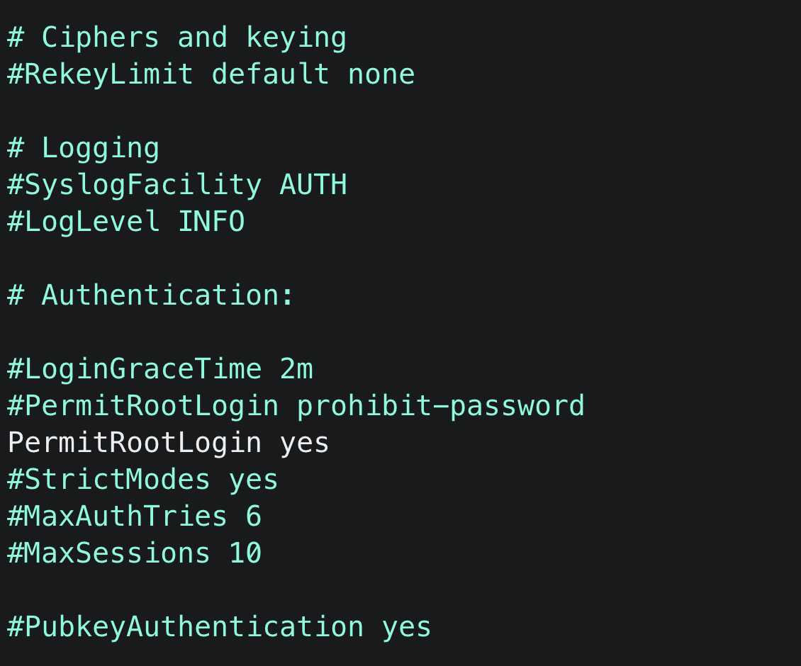

# SSH 🔐 Into A Docker Container 😎

- First Pull Ubuntu 🐧 Docker image from Docker Hub
    
    ```bash
    docker pull ubuntu:latest
    ```
    
- Run a container from that image
    
    ```bash
    docker run -it --name UbuntuServer -p 2200:22 -d ubuntu
    ```
    
- Attach The container to the terminal
    
    ```bash
    docker attach UbuntuServer
    ```
    
- Update the container and install openssh-server
    
    ```bash
    apt update
    apt install openssh-server
    ```
    
- once done check the status of ssh
    
    ```bash
    service --status-all
    echo "if the status is [-] ssh then run the follwing"
    service ssh start
    service --status-all
    echo "Status must be [+] ssh "
    ```
    
- set the root password
    
    ```bash
    passwd root
    # enter the password after pressing enter/return
    ```
    
- Now we need to change the contents of `sshd_config` file : add the following line
    - move to etc/ssh and open sshd_config file in your prefered code editor and add the following line
        ```bash
        PermitRootLogin yes
        ```

- Your file should look something like This :

---

- now open another terminal on mac and enter the following
    
    ```bash
    ssh root@localhost -p 2200
    ```
    
    - it will ask you to enter the password
    - once you enter you will be able to ssh into it easily

---
# Dockerfile 🧐
- We can achieve the same result as above by one dockerfile :
    - make a dockerfile :
    
    ```bash
    FROM debian
    
    RUN apt-get update \
        && apt-get install -y openssh-server \
        && apt install -y nano \
        && service ssh start \
        && echo "PermitRootLogin yes" >> /etc/ssh/sshd_config
    
    EXPOSE 22
    
    CMD ["/bin/bash"]
    ```
    
- make sure that you are in the same location where the above dockerfile is and run the following command :
    
    ```bash
    docker build -t my-debian-image .
    ```
    
    - on running the above command a Docker Image named my-debian-image  will get created
- now to run the container from the above image :
    
    ```bash
    docker run -it -p 2202:22 my-debian-container
    ```
    
- now make sure to check two things :
    - set root password :
        
        ```bash
        passwd root
        ```
        
    - ssh status
        
        ```bash
        service --status-all
        ```
        
    - if the status is [-]ssh then run
        
        ```bash
        service ssh start
        ```
        
    
    ---
